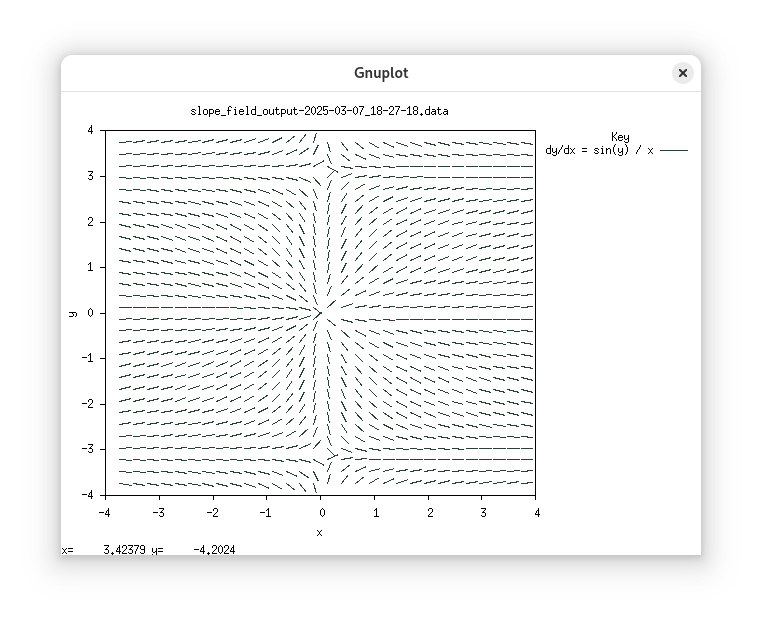

# Slope field visualizer

Interactive shell that generates slope field visualizations for Gnuplot



## Building & running

Prerequisites:

- [Rust toolchain](https://www.rust-lang.org/tools/install)
- [gnuplot](http://www.gnuplot.info)

```console
$ cargo build -r

$ cargo run -r
dy/dx = x - y
> help

help: display help for each command
quit: quit the shell
set: set expression to visualize
plot: plot slope field of expression that has been set
window: set window parameters
prog: print program compiled from the expression (for debugging)
```

## Why is it designed this way?
This was "for" a calculus class, but was mostly just an excuse to write code!
